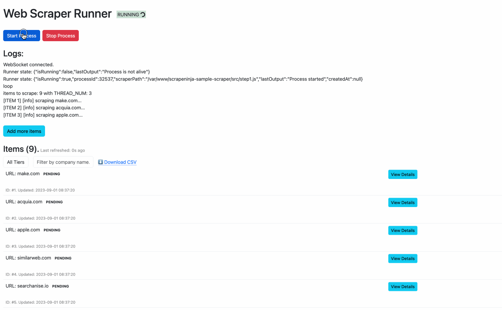

# Website Intelligence API Runner

This project demonstrates a multithreaded API runner using SQLite for storage and sourcing data from the [Company Intelligence API](https://apiroad.net/marketplace/apis/company-intelligence). This API provides insights often seen on platforms like Crunchbase and Semrush, such as funding details, website traffic analysis, founder profiles, social media links, and more.

## API Runner Use Case
The runner offers a foundational UI for long-running data enrichment pipelines. It provides real-time updates on data fetched from APIs (websocket powered) and ensures rapid and flexible persistent storage. Quick data filtering, pagination and CSV export features are available.

## Company Intelligence API Use Case
Consider having 10,000 user emails and a need to enrich each with company information for a more robust B2B sales pipeline. The Company Intelligence API is one such solution.

## Recommended: Docker Setup
1. Clone this repo.
2. Ensure Docker is installed.
3. Execute the following commands in the cloned repo directory:

```bash
# Build container. Execute once.
docker-compose build

# Initialize the database (once). This creates /data/scraper.sqlite3 on the host, mirrored in the Docker container.
docker-compose run scraper npm run init-db

# Start the Scraper Runner UI server.
docker-compose up
```

Since `docker-compose.yml` is configured to map host machine files into docker container, you can edit `src/step1.js` to modify scraper behaviour and restarting the scraper process will see the changes in the file without rebuilding the Dockerfile.

Now open `http://127.0.0.1:3020` in your browser to see the UI:



# Alternative: Running manually without Docker
## Pre-requisites:
- Node.js 16+
- SQLite 3.31+


## Setting up the database
Create an empty database with tables:
```bash
npx knex migrate:latest --env production
```
This command will create an empty `/data/scraper.sqlite3` database.

## Inserting seed test values:
```bash
npx knex seed:run --env production
```
This will add 3 sample URLs into the `items` table in the database for scraping.

# Retrieving your API key
This service requires subscription to a Website Intelligence API. Put your key into `.env` file in root folder of the project.


### Via APIRoad
Subscribe to ScrapeNinja at [ScrapeNinja API on APIRoad](https://apiroad.net/apis/company-intelligence) and obtain your API key.

### Via RapidAPI
The same API is also available on RapidAPI: https://rapidapi.com/restyler/api/website-intelligence (you will need to change API key name in the HTTP request then, check the code of `src/step1.js`)

## Configure scraper settings:

- Create a .env file in the project folder (you can copy from .env.dist).
- Set your `APIROAD_KEY` within this file.

# [OPTIONAL] Running the scraper without UI runner
The scraper process can be run by entering the following in your terminal:
```bash
node src/step1.js
```
This command fetches a set of items from the items table, available for scraping. If ScrapeNinja encounters an error, the `ep1ErrorCount` counter field will increment. Subsequent runs of `step1.js` will only fetch new items or failed items where `ep1ErrorCount` is less than 3.


# Querying the scraped data
The scraper stores the ScrapeNinja response in a data TEXT blob with embedded JSON. You can extract specific values at runtime using SQL queries:
```sql
select
  id,
  json_extract(data, '$.extractor') as extracted
from items
```

Retrieve raw HTML response and website response status code:
```sql
select
  id,
  json_extract(data, '$.info.statusCode') as httpStatus,
  json_extract(data, '$.body') as html
from items
```

Selecting just titles:
```sql
SELECT json_extract(data, '$.extractor.result.title') from items;
```

### Boosting Query Performance

Use generated columns:
Generated column support was added with SQLite version 3.31.0 (2020-01-22).

Add new virtual column:
```sql
alter table items
add column title string
as (json_extract(value, '$.extractor.result.title'));
```

Build an index:
```sql
create index items_title on items(title);
```

With the index in place, the following query should execute almost instantly:
```sql
select id, title
from items;
```
